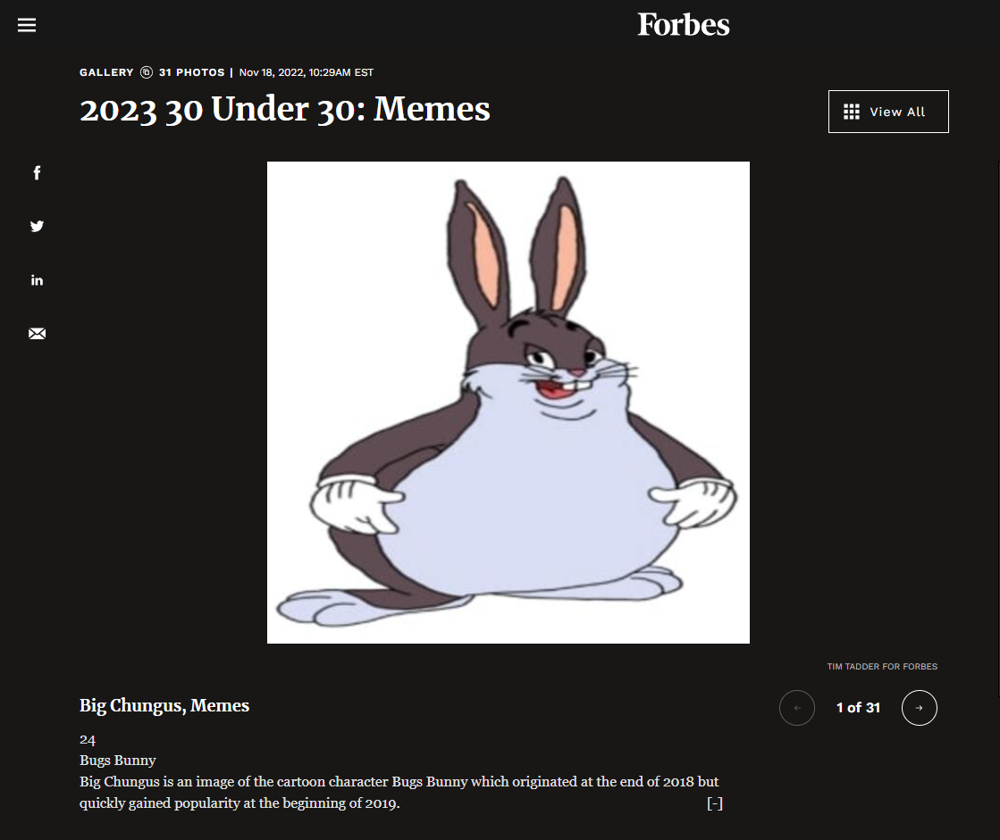

Include the code you changed on the webpage using [code blocks](https://docs.github.com/en/get-started/writing-on-github/working-with-advanced-formatting/creating-and-highlighting-code-blocks) in this file (`README.md`). Attach a screenshot of the final edit as well. You can attach images to a markdown file using the following syntax:

The code I changed:
```html
<h1 class="_7dVWw" data-test="slide title">2023 30 Under 30: Memes</h1>

<div class="kSyYc b_4CZ">
  <div
    class="jv3Hh"
style="background-image:url(https://steamuserimages-a.akamaihd.net/ugc/954100960630133341/EEB472A7E29156256044CF917885719D46A2BDF6/?imw=512&amp;&amp;ima=fit&amp;impolicy=Letterbox&amp;imcolor=%23000000&amp;letterbox=false?format=jpg&amp;width=1200)"
    role="img"
    aria-label="Graphic"
  ></div>
</div>

<div class="_6vf26">
  <h2 class="YmCqR">Big Chungus, Memes</h2>
  <div
    role="button"
    aria-label="expandandable/collapsable text"
    tabindex="0"
    class="JHCPi"
    fdprocessedid="jw99ra">
    <p></p>
    <p>24</p>
    <p>Bugs Bunny</p>
    <p>
      <span
        >Big Chungus is an image of the cartoon character Bugs Bunny which
        originated at the end of 2018 but quickly gained popularity at the
        beginning of 2019.<span class="truncate-text">[-]</span></span>
    </p>
  </div>
</div>
```



