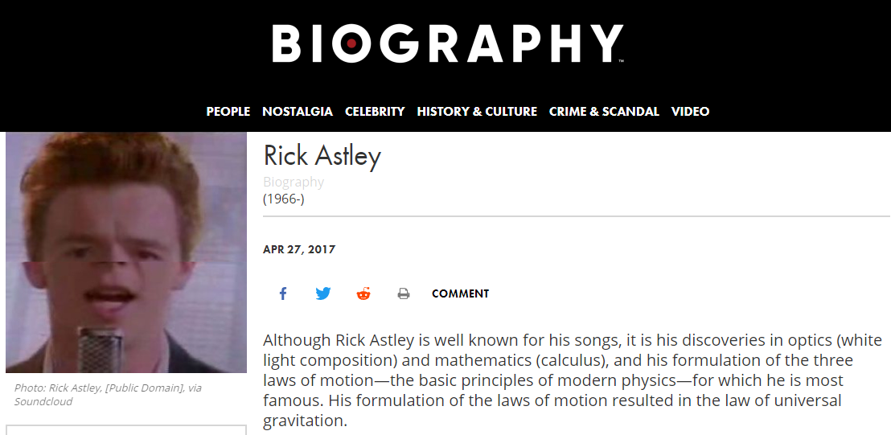

Include the code you changed on the webpage using [code blocks](https://docs.github.com/en/get-started/writing-on-github/working-with-advanced-formatting/creating-and-highlighting-code-blocks) in this file (`README.md`). Attach a screenshot of the final edit as well. You can attach images to a markdown file using the following syntax:
The code I changed:
```html
<h1 class="m-detail-header--title">Rick Astley</h1>

<div class="m-detail-header--person-occupations">(1966-)</div>

<div class="m-person--image l-person--image">
  
</div>

<figcaption>Photo: Rick Astley, [Public Domain], via Soundcloud</figcaption>

<div class="m-person--abstract l-person--abstract">
  Although Rick Astley is well known for his songs, it is his discoveries in
  optics (white light composition) and mathematics (calculus), and his
  formulation of the three laws of motion—the basic principles of modern
  physics—for which he is most famous. His formulation of the laws of motion
  resulted in the law of universal gravitation.
</div>
```



