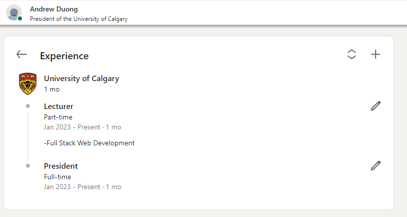

Include the code you changed on the webpage using [code blocks](https://docs.github.com/en/get-started/writing-on-github/working-with-advanced-formatting/creating-and-highlighting-code-blocks) in this file (`README.md`). Attach a screenshot of the final edit as well. You can attach images to a markdown file using the following syntax:

The code I changed:
```html
<div id="ember453" class="artdeco-entity-lockup__subtitle ember-view truncate">
  President of the University of Calgary
</div>

<span aria-hidden="true"><!---->Lecturer<!----></span>
<span aria-hidden="true"><!---->Part-time<!----></span>
<span aria-hidden="true"><!---->-Full Stack Web Development<!----></span>

<span aria-hidden="true"><!---->President<!----></span>
<span aria-hidden="true"><!---->Full-time<!----></span>
```





