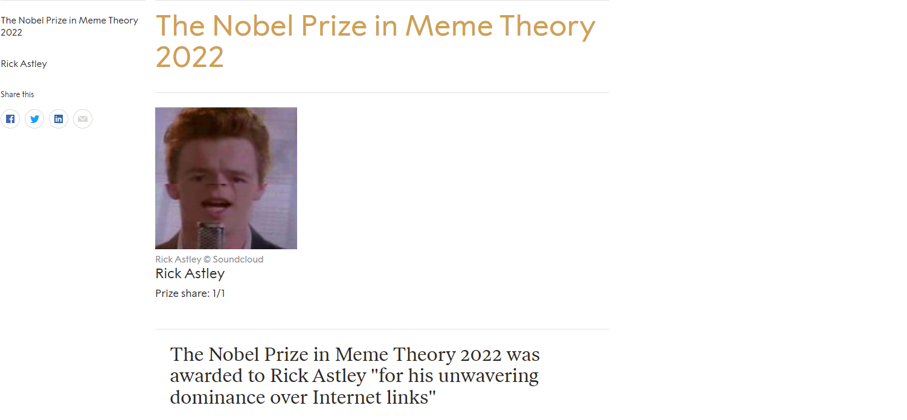

Include the code you changed on the webpage using [code blocks](https://docs.github.com/en/get-started/writing-on-github/working-with-advanced-formatting/creating-and-highlighting-code-blocks) in this file (`README.md`). Attach a screenshot of the final edit as well. You can attach images to a markdown file using the following syntax:

The code I changed:
```html
<header class="heading">
  <h1>The Nobel Prize in Meme Theory 2022</h1>
</header>

<header class="header">
  <h5 class="heading">The Nobel Prize in Meme Theory 2022</h5>
</header>

<li class="list-laureate" itemscope="" itemtype="http://schema.org/Person">
  <a
    href="https://www.youtube.com/watch?v=dQw4w9WgXcQ/"
    class=""
    itemprop="url"
    title="Rick Astley">
    <span itemprop="name">Rick Astley</span>
  </a>
</li>

<li>
  <span class="category-title"> The Nobel Prize in Meme Theory 2022 </span>
</li>

<picture
  ><source
    data-srcset="https://www.nobelprize.org/uploads/2022/10/ernaux-2_3-464x696.jpg"
    media="(min-width: 220px)"
    srcset="https://i1.sndcdn.com/artworks-000094489636-qzznk3-t500x500.jpg" />
  <source
    data-srcset="https://www.nobelprize.org/uploads/2022/10/ernaux-2_3-640x960.jpg"
    media="(min-width: 900px)"
    srcset="https://i1.sndcdn.com/artworks-000094489636-qzznk3-t500x500.jpg" />
  <source
    data-srcset="https://i1.sndcdn.com/artworks-000094489636-qzznk3-t500x500.jpg"
    media="(min-width: 1400px)"
    srcset="https://i1.sndcdn.com/artworks-000094489636-qzznk3-t500x500.jpg" />
  <noscript
    ></noscript
></picture>

<figcaption class="figcaption">
  <p class="figcaption__attribution">Rick Astley © Soundcloud</p>
</figcaption>

<h3 itemprop="name">
  <a
    href="https://www.youtube.com/watch?v=dQw4w9WgXcQ"
    title="Title text"
    itemprop="url"
    >Rick Astley
  </a>
</h3>

<blockquote
  class="border-top pageblockquote"
  itemscope=""
  itemtype="http://schema.org/Quotation">
  The Nobel Prize in Meme Theory 2022 was awarded to Rick Astley "for his
  unwavering dominance over Internet links"
</blockquote>
```




