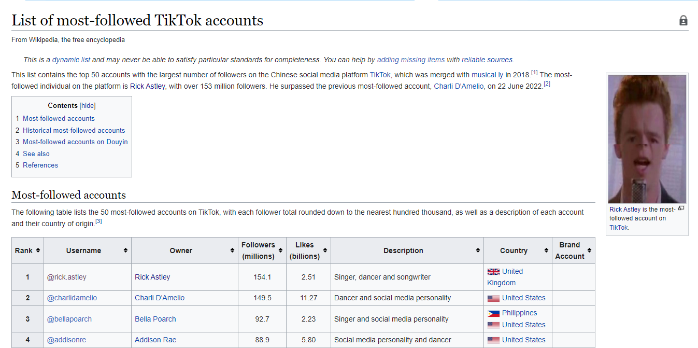

Include the code you changed on the webpage using [code blocks](https://docs.github.com/en/get-started/writing-on-github/working-with-advanced-formatting/creating-and-highlighting-code-blocks) in this file (`README.md`). Attach a screenshot of the final edit as well. You can attach images to a markdown file using the following syntax:
The code I changed:
```html
<a href="https://www.youtube.com/watch?v=dQw4w9WgXcQ" title="Rick Astley"
  >Rick Astley</a>

<a
  href="https://i1.sndcdn.com/artworks-000094489636-qzznk3-t500x500.jpg"
  class="image">
</a>

<div class="thumbcaption">
  <div class="magnify">
    <a
      href="https://www.youtube.com/watch?v=dQw4w9WgXcQ"
      class="internal"
      title="Enlarge"
    ></a>
  </div>
  <a href="https://www.youtube.com/watch?v=dQw4w9WgXcQ" title="Rick Astley"
    >Rick Astley</a
  >
  is the most-followed account on
  <a href="/wiki/TikTok" title="TikTok">TikTok</a>.
</div>

<span class="plainlinks"
  ><a
    rel="nofollow"
    class="external text"
    href="https://www.youtube.com/watch?v=dQw4w9WgXcQ"
    >@rick.astley</a
  ></span>

<td>
  <a href="https://www.youtube.com/watch?v=dQw4w9WgXcQ" title="Rick Astley"
    >Rick Astley</a>
</td>

<td>Singer, dancer and songwriter</td>

<span class="flagicon">
    &nbsp;</span>

<a href="/wiki/United_Kingdom" title="United Kingdom">United Kingdom</a>
```




